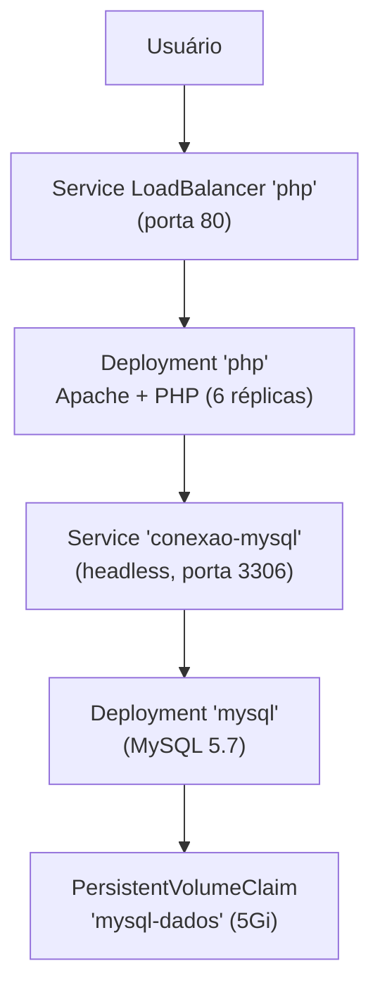

# ☸️ Deploy de Aplicação com Docker e Kubernetes

> Projeto desenvolvido como desafio prático durante estudos na [DIO](https://www.dio.me).


---

## 📖 Sobre o Projeto

Este repositório faz parte do meu **portfólio de aprendizado**. Foi desenvolvido durante o desafio **"Criando um Deploy de uma Aplicação"** da DIO, com o objetivo de praticar a containerização e a orquestração de uma aplicação completa (frontend, backend e banco de dados) utilizando Docker e Kubernetes.

Trata-se de um laboratório prático de estudos, não de um projeto profissional. Ele consolidou fundamentos como containerização, criação de imagens Docker personalizadas, orquestração de contêineres, persistência de dados e deploy em cluster Kubernetes.

## 🎯 Objetivo

Containerizar e realizar o deploy de uma aplicação composta por **frontend**, **backend** e **banco de dados MySQL**, expondo o backend por um **Service LoadBalancer** e conectando a aplicação ao banco por meio de **service discovery** dentro do cluster Kubernetes.

## 🏗️ Arquitetura

O cluster Kubernetes orquestra os três componentes da aplicação:



- O **Service `php`** (tipo `LoadBalancer`) expõe o backend na porta 80 para o usuário.
- O **Deployment `php`** executa o Apache + PHP com o código do backend.
- O backend conecta-se ao MySQL através do **Service `conexao-mysql`**, um serviço headless (`clusterIP: None`) que fornece o endereço do pod do banco via DNS do cluster.
- O **Deployment `mysql`** executa o MySQL 5.7 e grava os dados no disco persistente vinculado ao **PersistentVolumeClaim `mysql-dados`**.

O frontend (HTML/CSS/JS) é estático e roda no navegador do cliente, enviando os dados do formulário para o backend via requisição AJAX.

## 📦 Componentes

### Frontend

Página estática com HTML, CSS e JavaScript (jQuery). Apresenta um formulário de contato e envia nome, e-mail e comentário para o backend.

### Backend

Aplicação em PHP executada no Apache. O `index.php` recebe os dados via POST e insere um registro na tabela `mensagens` do MySQL. A conexão é feita pelo `conexao.php`, que aponta para o host `conexao-mysql` (nome do Service no cluster).

### Database

MySQL 5.7 com script SQL de inicialização (`sql.sql`) que cria o banco `meubanco` e a tabela `mensagens`.

## 🐳 Docker

Foram criadas duas imagens personalizadas, ambas publicadas no [Docker Hub](https://hub.docker.com/) sob o usuário `herissonsilvam`:

| Imagem | Base | Finalidade |
| --- | --- | --- |
| `herissonsilvam/app-desafio-dio-backend:1.0` | `php:7.4-apache` | Backend PHP/Apache com extensões `gd`, `pdo_mysql` e `mysqli`; porta 80 |
| `herissonsilvam/app-desafio-dio-database:1.0` | `mysql:5.7` | MySQL com banco `meubanco`, tabela `mensagens` e credenciais definidas; porta 3306 |

Essas imagens são referenciadas diretamente nos Deployments do Kubernetes.

## ☸️ Kubernetes

Objetos declarados nos manifests do projeto:

- **Deployment `php`** — 6 réplicas da imagem backend, porta 80.
- **Deployment `mysql`** — imagem MySQL, porta 3306, com volume montado em `/var/lib/mysql/`.
- **Service `php`** — tipo `LoadBalancer`, expõe a porta 80 dos pods do backend.
- **Service `conexao-mysql`** — headless (`clusterIP: None`), usado para service discovery do MySQL na porta 3306.
- **PersistentVolumeClaim `mysql-dados`** — solicita 5Gi de armazenamento com acesso `ReadWriteOnce`.

> Importante: o repositório declara apenas o **PersistentVolumeClaim (PVC)**. O **PersistentVolume (PV)** correspondente é provisionado dinamicamente pelo cluster (na GCP, via `storageClassName: standard-rwo`).

## 🔁 Automação

O `script.sh` automatiza todo o fluxo de deploy:

```bash
docker build → docker push → kubectl apply -f services.yml → kubectl apply -f deployment.yml
```

1. Cria as duas imagens Docker;
2. Envia as imagens para o Docker Hub;
3. Aplica os Services no cluster (`kubectl apply -f services.yml`);
4. Aplica o PVC e os Deployments no cluster (`kubectl apply -f deployment.yml`).

## 🗂️ Estrutura do Repositório

```text
app-k8s-desafio-dio/
├── backend/
│   ├── dockerfile       # Imagem PHP/Apache com o código do backend
│   ├── conexao.php      # Conexão com o MySQL via Service 'conexao-mysql'
│   └── index.php        # Endpoint que insere os dados no banco
├── database/
│   ├── dockerfile       # Imagem MySQL 5.7 com banco e tabela definidos
│   └── sql.sql          # Criação do banco 'meubanco' e da tabela 'mensagens'
├── frontend/
│   ├── index.html       # Formulário estático
│   ├── css.css          # Estilos do formulário
│   └── js.js            # Envio dos dados via AJAX (jQuery)
├── deployment.yml       # PVC + Deployments (mysql e php)
├── services.yml         # Services (LoadBalancer e headless)
├── script.sh            # Automação do build, push e deploy
└── README.md            # Documentação do projeto
```

## 🔄 Como o Projeto Funcionava

1. O `script.sh` criava e publicava as imagens e aplicava os manifests no cluster;
2. O usuário acessava o frontend (formulário estático) e preenchia nome, e-mail e comentário;
3. O frontend enviava os dados via AJAX para o backend, exposto pelo Service LoadBalancer;
4. O `index.php` conectava-se ao MySQL através do Service headless `conexao-mysql` e inseria o registro na tabela `mensagens`;
5. Os dados eram persistidos no volume `mysql-dados`.

## 🛠️ Tecnologias Utilizadas

- Docker
- Kubernetes
- Google Cloud Platform (GCP)
- PHP 7.4
- Apache
- MySQL 5.7
- HTML
- CSS
- JavaScript (jQuery)
- Shell Script

## 🧠 Conceitos Praticados

- Containerização de aplicações
- Criação de imagens Docker personalizadas
- Publicação de imagens em registry (Docker Hub)
- Orquestração de contêineres com Kubernetes
- Deployments
- Services (LoadBalancer e headless)
- Service discovery
- Exposição de aplicação via LoadBalancer
- Persistência com PersistentVolumeClaim
- Comunicação aplicação/banco
- Automação com Shell Script
- Deploy em cluster Kubernetes em nuvem

## 🎓 Contexto de Aprendizado

Este projeto foi desenvolvido como um **desafio prático da DIO** e faz parte do meu portfólio de estudos. Ele documenta minha evolução em contêineres e orquestração e não deve ser interpretado como uma aplicação pronta para produção — foi construído para demonstrar o deploy de uma aplicação em um ambiente Kubernetes.

## 📌 Observações

- O projeto foi desenvolvido originalmente utilizando um cluster Kubernetes na Google Cloud Platform (GCP), conforme o contexto do desafio.
- As imagens personalizadas foram publicadas no Docker Hub; não há garantia de que continuem disponíveis.
- Por se tratar de um laboratório de aprendizado, os arquivos contêm credenciais de exemplo para ambiente local.